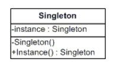

# Singleton


##	How is a singleton implemented?
#### Java:
To implement Singleton pattern, we have different approaches but all of them have following common concepts.

- Private constructor to restrict instantiation of the class from other classes.
- Private static variable of the same class that is the only instance of the class.
- Public static method that returns the instance of the class, this is the global access point for outer world to get the instance of the singleton class.

The instance is usually stored as a private static variable; the instance is created when the variable is initialized, at some point before the static method is first called. The following is a sample implementation written in Java.

Below is an implementation of singleton class
```
public final class Singleton {
    private static final Singleton INSTANCE = new Singleton();

    private Singleton() {}

    public static Singleton getInstance() {
        return INSTANCE;
    }
}

```

**Eager initialization**

In eager initialization, the instance of Singleton Class is created at the time of class loading, this is the easiest method to create a singleton class but it has a drawback that instance is created even though client application might not be using it.


Following is the implementation of static initialization singleton class.
```
public class EagerInitializedSingleton {

    private static final EagerInitializedSingleton instance = new EagerInitializedSingleton();

    //private constructor to avoid client applications to use constructor
    private EagerInitializedSingleton(){}

    public static EagerInitializedSingleton getInstance(){
        return instance;
    }
}
```

**Static block initialization**

Static block initialization implementation is similar to eager initialization, except that instance of class is created in the static block that provides option for exception handling.

```
public class StaticBlockSingleton {

    private static StaticBlockSingleton instance;

    private StaticBlockSingleton(){}

    //static block initialization for exception handling
    static{
        try{
            instance = new StaticBlockSingleton();
        }catch(Exception e){
            throw new RuntimeException("Exception occured in creating singleton instance");
        }
    }

    public static StaticBlockSingleton getInstance(){
        return instance;
    }
}
```

#### C#:



Even though Singleton is a comparatively simple pattern, there are various tradeoffs and options, depending upon the implementation.

```
using System;

public class Singleton
{
   private static Singleton instance;

   private Singleton() {}

   public static Singleton Instance
   {
      get
      {
         if (instance == null)
         {
            instance = new Singleton();
         }
         return instance;
      }
   }
}

```


The main disadvantage of this implementation, however, is that it is not safe for multithreaded environments. If separate threads of execution enter the Instance property method at the same time, more that one instance of the Singleton object may be created. Each thread could execute the following statement and decide that a new instance has to be created:
```
if (instance == null)
```
Various approaches solve this problem. One approach is to use an idiom referred to as Double-Check Locking. However, C# in combination with the common language runtime provides a static initialization approach, which circumvents these issues without requiring the developer to explicitly code for thread safety.


##	Can it be made thread-safe?
#### C#:
In the following code, the thread is locked on a shared object and checks whether an instance has been created or not with double checking.

```
public sealed class Singleton

{
    Singleton()
    {
    }

    private static readonly object padlock = new object();

    private static Singleton instance = null;
    public static Singleton Instance
    {
        get
        {
            if (instance == null)
            {
                lock (padlock)
                {
                    if (instance == null)
                    {
                        instance = new Singleton();
                    }
                }
            }
            return instance;
        }
    }
}
```

#### Java
The easier way to create a thread-safe singleton class is to make the global access method synchronized, so that only one thread can execute this method at a time. General implementation of this approach is like the below class.

```
public class ThreadSafeSingleton {

    private static ThreadSafeSingleton instance;

    private ThreadSafeSingleton(){}

    public static synchronized ThreadSafeSingleton getInstance(){
        if(instance == null){
            instance = new ThreadSafeSingleton();
        }
        return instance;
    }

}
```

##	Can the singleton instance be lazily instantiated?
#### C#:

In below piece of code, instantiation is triggered by the first reference to the static member of the nested class, that only occurs in Instance. This means the implementation is fully lazy. Note that although nested classes have access to the enclosing class's private members, the reverse is not true, hence the need for instance to be internal here.

```
public sealed class Singleton

{
    private static readonly Singleton instance = new Singleton();

    // Explicit static constructor to tell C# compiler
    // not to mark type as beforefieldinit
    static Singleton()
    {
    }

    private Singleton()
    {
    }

    public static Singleton Instance
    {
        get
        {
            return instance;
        }
    }
}
```

#### Java:
**Lazy Initialization**

Lazy initialization method to implement Singleton pattern creates the instance in the global access method.

Following is the sample code for creating Singleton class using above approach.

```
public class LazyInitializedSingleton {

    private static LazyInitializedSingleton instance;

    private LazyInitializedSingleton(){}

    public static LazyInitializedSingleton getInstance(){
        if(instance == null){
            instance = new LazyInitializedSingleton();
        }
        return instance;
    }
}

```


References:
1. http://www.journaldev.com/1377/java-singleton-design-pattern-best-practices-examples
2. https://en.wikipedia.org/wiki/Singleton_pattern
3. http://www.c-sharpcorner.com/UploadFile/8911c4/singleton-design-pattern-in-C-Sharp/
